# Diseño UI

_Presentar al menos un wireframe por pantalla o módulo relevante._
_Los wireframes en imagen o PDF van en `diagramas/wireframes/`; acá se documenta la justificación de cada uno._

Los wireframes son de baja fidelidad (grises y un único color de acción) y cada imagen trae a la derecha sus propias referencias de lectura numeradas. Los textos, nombres y precios son datos de ejemplo.

---

## Pantalla / Módulo 1 — Inicio

**Wireframe:** `diagramas/wireframes/01-inicio.png`

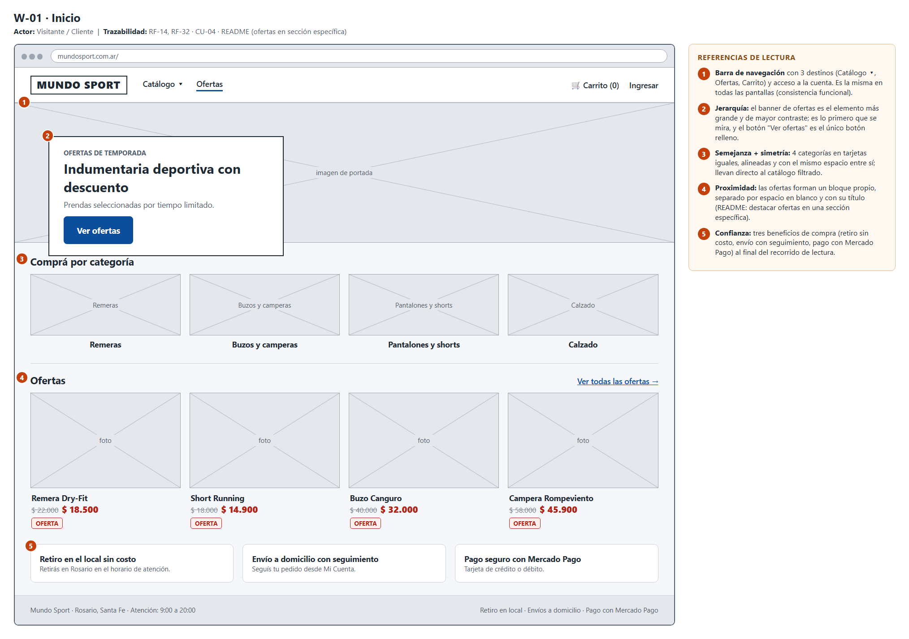

**Patrones de diseño utilizados:** barra de navegación global fija, banner destacado (hero), grilla de tarjetas (Card) y franja de beneficios.

**Justificación:** el menú tiene solo 3 destinos (Catálogo ▾, Ofertas y Carrito) más el acceso a la cuenta, y es el mismo en todas las pantallas de la tienda. Mundo Sport hoy vende por Instagram y WhatsApp, así que el cliente típico llega a ver prendas y precios, no a explorar: con pocos destinos y siempre en el mismo lugar no tiene que aprender a moverse. La jerarquía de lectura es banner de ofertas → categorías → ofertas → beneficios; el banner es el elemento más grande y el único con botón relleno. Las 4 categorías son tarjetas iguales y alineadas (semejanza y simetría) y cada bloque está separado del siguiente por espacio en blanco y un título (proximidad). La sección propia de ofertas responde al alcance del README ("destacar ofertas en una sección específica") y a RF-32.

---

## Pantalla / Módulo 2 — Catálogo con filtros

**Wireframe:** `diagramas/wireframes/02-catalogo.png` (escritorio) y `diagramas/wireframes/13-catalogo-movil.png` (celular, 360 px)

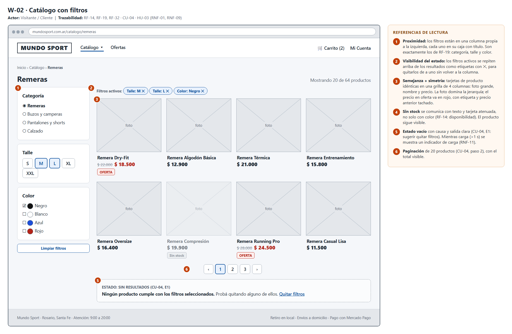

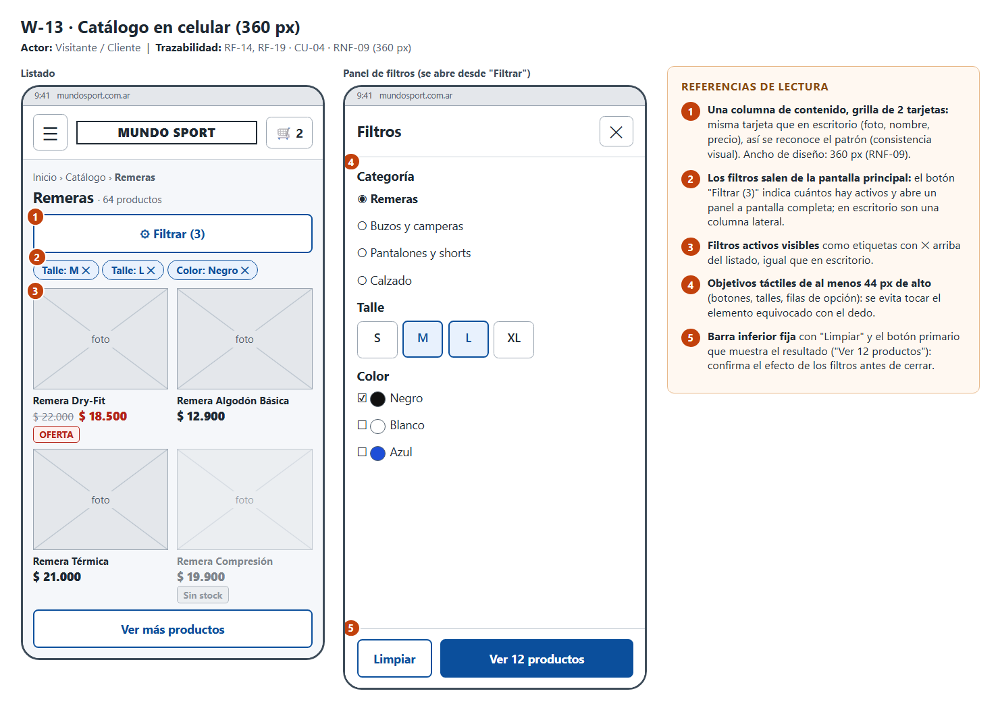

**Patrones de diseño utilizados:** filtros en columna lateral (en celular, panel de filtros a pantalla completa), etiquetas de filtros activos (chips), grilla de tarjetas, paginación y estado vacío.

**Justificación:** RF-19 pide filtrar por categoría, talle y color, y en indumentaria el talle y el color son lo que decide si el cliente compra. Por eso en escritorio los filtros están siempre visibles en una columna, cada uno en su caja con título (proximidad), en lugar de ocultos en un desplegable. Los filtros activos se repiten arriba de los resultados como etiquetas con ✕: el cliente ve qué está filtrando y puede quitar uno por uno. Se usa paginación de 20 productos (CU-04, paso 2) y no scroll infinito, para poder volver a la misma página y llegar al pie con la información de retiro y envío. Un producto sin stock sigue visible, atenuado y con la etiqueta "Sin stock" (RF-14). En el celular una columna lateral no entra en 360 px (RNF-09), así que los filtros pasan a un panel propio con una barra inferior fija cuyo botón informa el resultado ("Ver 12 productos"). Si ningún producto coincide, se explica la causa y se sugiere quitar filtros (CU-04, E1); si la carga tarda más de 1 s, se muestra un indicador de carga (RNF-11).

---

## Pantalla / Módulo 3 — Detalle de producto

**Wireframe:** `diagramas/wireframes/03-detalle-producto.png`

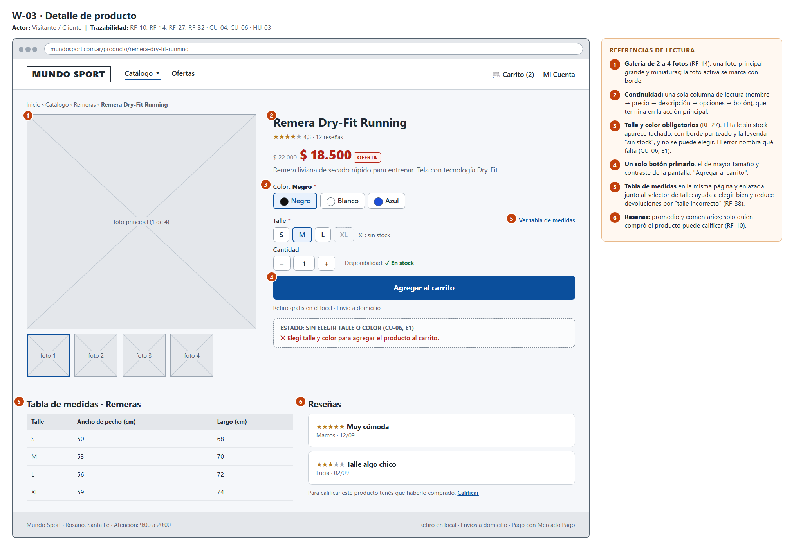

**Patrones de diseño utilizados:** galería con miniaturas, selector de variantes con botones (talle y color), botón de acción único, tabla de medidas y listado de reseñas en la misma página.

**Justificación:** talle y color son obligatorios para agregar al carrito (RF-27), por eso se eligen con botones visibles y no con listas desplegables: se ven todas las opciones y cuáles no tienen stock (talle tachado, con borde punteado y la leyenda "sin stock", sin depender solo del color). La información sigue una sola columna de lectura (nombre → precio → descripción → opciones → botón) que termina en la acción, y "Agregar al carrito" es el botón más grande y de mayor contraste. La galería muestra de 2 a 4 fotos (RF-14). La tabla de medidas está en la misma página y enlazada junto al selector de talle: "talle incorrecto" es uno de los motivos de devolución de RF-38, y ayudar a elegir bien es la forma más barata de evitarlo. Las reseñas van debajo y solo quien compró el producto puede calificarlo (RF-10).

---

## Pantalla / Módulo 4 — Carrito

**Wireframe:** `diagramas/wireframes/04-carrito.png`

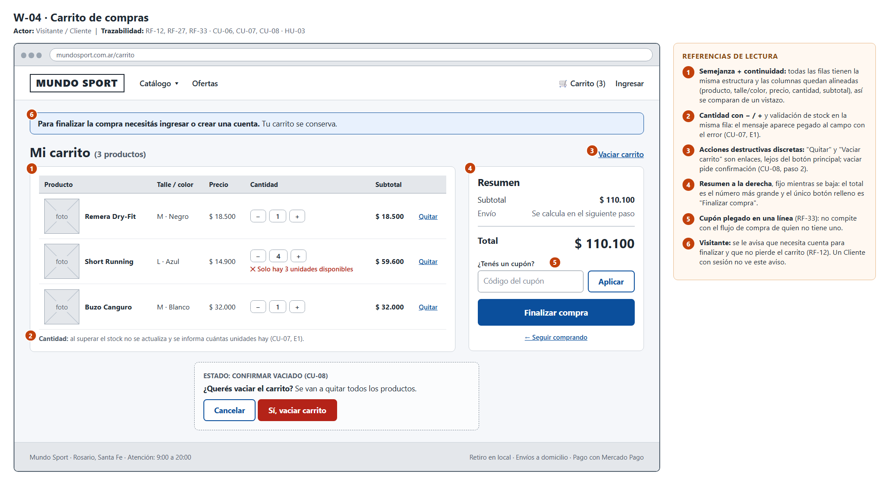

**Patrones de diseño utilizados:** tabla de ítems con selector de cantidad (− / +), resumen lateral fijo, diálogo de confirmación para acciones destructivas y campo de cupón plegado.

**Justificación:** todas las filas repiten la misma estructura y las columnas quedan alineadas (semejanza y continuidad), lo que permite comparar precios y cantidades de un vistazo. El control de cantidad valida el stock en la misma fila y el mensaje aparece pegado al campo con el problema (CU-07, E1). "Quitar" y "Vaciar carrito" son enlaces secundarios, lejos del botón principal, y vaciar pide confirmación (CU-08, paso 2) para evitar descuidos. El resumen queda a la derecha con el total como número más grande y "Finalizar compra" como único botón relleno. El campo de cupón se muestra plegado en una línea: RF-33 define los cupones y el ER registra su uso (`CUPON_USADO`), pero quien no tiene uno no debe distraerse. Si quien compra es un Visitante, se le avisa que necesita cuenta para finalizar y que su carrito se conserva (RF-12).

---

## Pantalla / Módulo 5 — Checkout (entrega, envío y pago)

**Wireframe:** `diagramas/wireframes/05-checkout-entrega.png`, `diagramas/wireframes/06-checkout-pago.png` y `diagramas/wireframes/14-checkout-movil.png` (celular, 360 px)

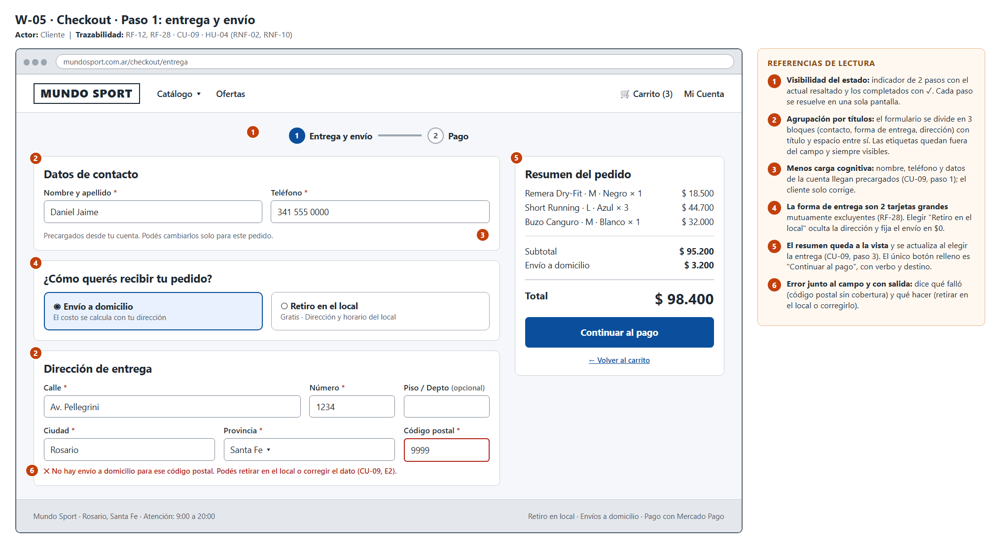

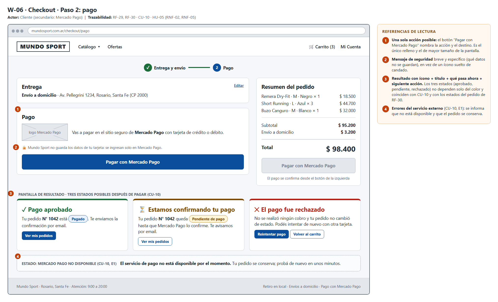

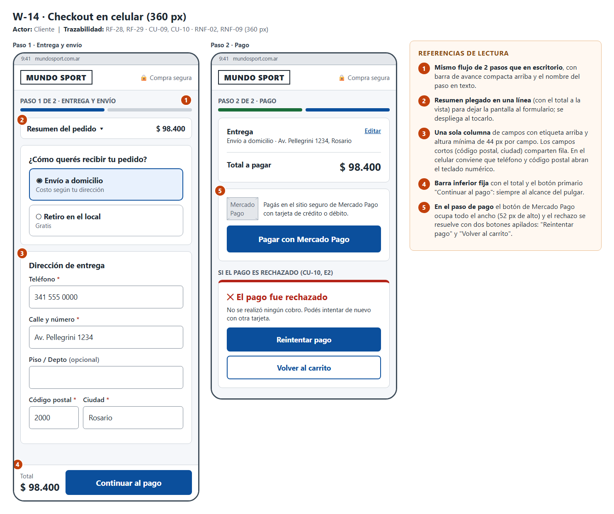

**Patrones de diseño utilizados:** formulario por pasos con indicador de progreso (2 pasos), tarjetas de selección excluyente para la forma de entrega, resumen del pedido siempre visible, redirección a la pasarela externa con pantalla de resultado, y barra inferior fija en celular.

**Justificación:** CU-09 y CU-10 son dos decisiones distintas del cliente (cómo recibo mi pedido / cómo pago), y la segunda ocurre fuera del sitio, en Mercado Pago; por eso se separan en 2 pasos y no se agrupan en una sola pantalla. No se divide en más pasos porque el formulario es corto (ver abajo) y cada paso extra aumenta el abandono. La forma de entrega son dos tarjetas grandes y excluyentes (RF-28): la elección condiciona qué se muestra (dirección y costo, o dirección del local y horario) y el resumen actualiza el total al elegir (CU-09, paso 3). El paso de pago tiene una sola acción posible, con un botón que nombra la acción y el destino ("Pagar con Mercado Pago"), y un aviso concreto de qué datos no se guardan. El resultado del pago (aprobado, pendiente o rechazado) se comunica con ícono, título, qué pasa con el pedido y la siguiente acción, y coincide con CU-10 (E1 a E3) y con los estados de RF-30. En celular el resumen se pliega en una línea con el total y el botón principal queda en una barra fija, al alcance del pulgar.

**Formulario (si aplica):**
- Cantidad de campos: 8 en el paso de entrega (nombre y apellido, teléfono, calle, número, piso/depto opcional, ciudad, provincia y código postal), más la elección de forma de entrega. Los datos que el cliente ya cargó al registrarse (RF-06) llegan precargados. El paso de pago no tiene campos: la tarjeta se ingresa en Mercado Pago.
- Flujo: por pasos (1. Entrega y envío → 2. Pago), cada uno en una sola pantalla.
- Validaciones relevantes: campos obligatorios (dirección, ciudad, código postal y teléfono, CU-09 E1); código postal con cobertura de envío, y si no la tiene se ofrece retirar en el local o corregirlo (E2); si falla la consulta de tarifa se pide reintentar sin perder los datos (E3); todo error se muestra junto al campo e indica cuál es (RNF-10).

---

## Pantalla / Módulo 6 — Ingreso

**Wireframe:** `diagramas/wireframes/07-ingreso.png`

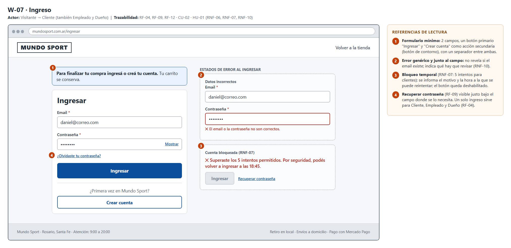

**Patrones de diseño utilizados:** tarjeta de ingreso centrada, aviso contextual, mensajes de error junto al campo y estado de bloqueo temporal.

**Justificación:** RF-04 define un único ingreso con email y contraseña para clientes y personal, así que hay una sola pantalla y el sistema muestra después lo que corresponde al rol. El formulario es mínimo (2 campos) con "Ingresar" como único botón relleno y "Crear cuenta" como acción secundaria, separada por una línea. Cuando el cliente llega desde el carrito se muestra un aviso (RF-12) que explica por qué se le pide ingresar y que no pierde sus productos. El error por datos incorrectos es genérico (no revela si el email existe) y queda junto al campo; el bloqueo por intentos fallidos (RNF-07) informa el motivo y la hora a la que se puede volver a intentar, y deshabilita el botón. "¿Olvidaste tu contraseña?" (RF-09) está justo bajo el campo donde se la necesita.

**Formulario (si aplica):**
- Cantidad de campos: 2 (email y contraseña).
- Flujo: todo en una pantalla.
- Validaciones relevantes: credenciales correctas; bloqueo temporal tras 5 intentos fallidos para clientes (15 minutos) y 3 para empleados (30 minutos), según RNF-07.

---

## Pantalla / Módulo 7 — Registro de cliente

**Wireframe:** `diagramas/wireframes/08-registro.png`

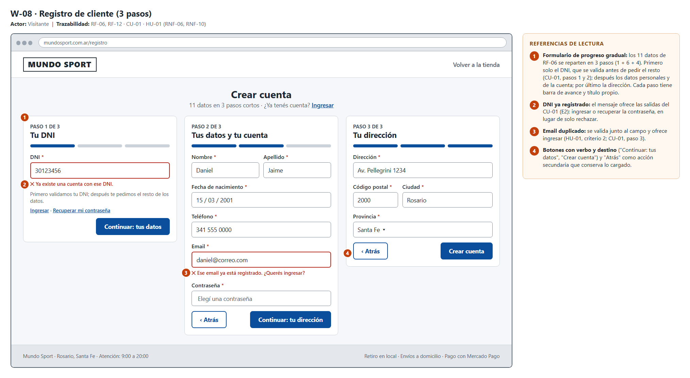

**Patrones de diseño utilizados:** formulario de progreso gradual en 3 pasos con barra de avance, validación en el momento y botones con verbo y destino.

**Justificación:** RF-06 pide 11 datos, demasiados para una sola pantalla en un celular. Se reparten en 3 pasos, agrupados por tema y cada uno con título y barra de avance, para que el cliente sepa cuánto falta. El primer paso pide solo el DNI y lo valida antes de mostrar el resto, igual que el CU-01 (pasos 1 y 2), de modo que quien ya tiene cuenta lo sabe de entrada y no pierde tiempo completando todo el formulario. Cada error se muestra junto al campo, con la causa y el formato esperado (por ejemplo "Ingresá el DNI sin puntos (7 u 8 números)"). Si el DNI o el email ya existen, el mensaje ofrece la salida (ingresar o recuperar la contraseña, "¿Querés ingresar?") en vez de solo rechazar. Los botones dicen qué viene después ("Continuar: tus datos", "Crear cuenta") y "Atrás" es una acción secundaria que conserva lo ya cargado.

**Formulario (si aplica):**
- Cantidad de campos: 11, repartidos en 3 pasos (1 + 6 + 4): DNI; nombre, apellido, fecha de nacimiento, teléfono, email y contraseña; dirección, código postal, ciudad y provincia.
- Flujo: por pasos.
- Validaciones relevantes: todos los datos son obligatorios; formato válido de email y DNI; no se permite registrar un email o DNI ya existente (HU-01, criterio 2; CU-01, E2); mensaje de error junto al campo (RNF-10).

---

## Pantalla / Módulo 8 — Mi Cuenta: pedidos y devolución

**Wireframe:** `diagramas/wireframes/09-mi-cuenta.png`

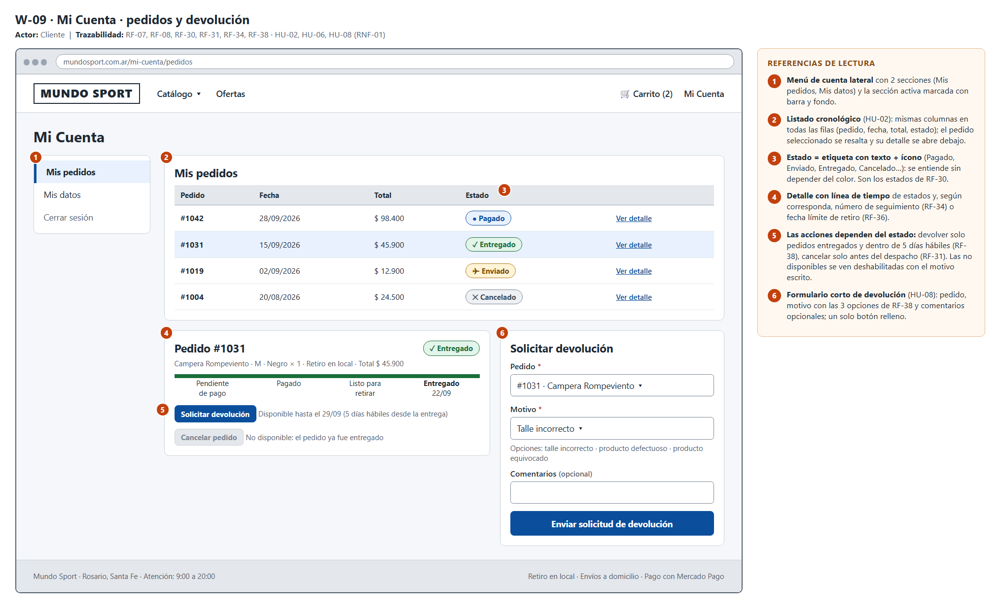

**Patrones de diseño utilizados:** menú lateral de cuenta, listado con detalle desplegable (maestro–detalle), etiquetas de estado con ícono y texto, línea de tiempo de estados, acciones condicionadas al estado y formulario corto.

**Justificación:** HU-02 pide un listado cronológico con código, fecha, importe y estado. Todas las filas tienen las mismas columnas (semejanza) y el pedido elegido se resalta y abre su detalle debajo, sin cambiar de pantalla. El estado es una etiqueta con ícono y texto (Pagado, Enviado, Entregado…), que se entiende sin depender del color y refleja los estados de RF-30. El detalle muestra una línea de tiempo y, según el caso, el número de seguimiento (RF-34) o la fecha límite de retiro (RF-36). Las acciones dependen del estado: se puede devolver solo un pedido entregado y dentro de los 5 días hábiles (RF-38), y cancelar solo antes del despacho (RF-31); cuando una acción no está disponible se ve deshabilitada y con el motivo escrito, en lugar de desaparecer.

**Formulario (si aplica):**
- Cantidad de campos: 3 (pedido, motivo y comentarios opcionales).
- Flujo: todo en una pantalla, junto al detalle del pedido.
- Validaciones relevantes: solo pedidos entregados y dentro de los 5 días hábiles posteriores a la entrega o el retiro (RF-38); motivo obligatorio entre talle incorrecto, producto defectuoso o producto equivocado; confirmación visible al registrar la solicitud (HU-08, criterio 5).

---

## Pantalla / Módulo 9 — Panel de administración

**Wireframe:** `diagramas/wireframes/10-panel-administracion.png`

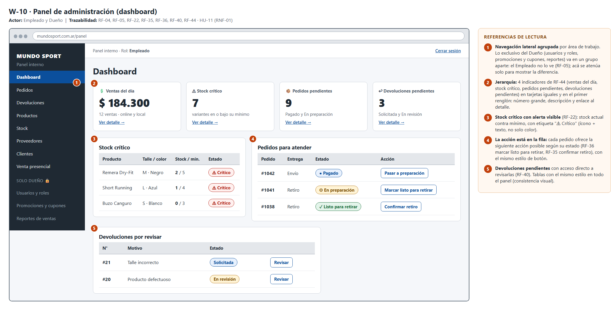

**Patrones de diseño utilizados:** dashboard de indicadores en tarjetas, navegación lateral agrupada por rol y tablas con acción en cada fila.

**Justificación:** la empleada de atención opera el sistema todos los días y el stakeholder del Dueño es usuario principal del panel, por lo que la pantalla prioriza lo que hay que atender: los 4 indicadores de RF-44 (ventas del día, stock crítico, pedidos pendientes y devoluciones pendientes) van en tarjetas iguales en el primer renglón, con el número en tamaño grande. Debajo, cada lista ofrece la acción siguiente en la misma fila (marcar listo para retirar, confirmar retiro, revisar una devolución: RF-36, RF-35, RF-40) y el stock bajo el mínimo (RF-22) se marca con ícono y texto. El menú lateral agrupa las áreas de trabajo y separa lo exclusivo del Dueño (usuarios y roles, promociones y cupones, reportes): el Empleado no lo ve, porque el Dueño configura las funcionalidades por rol (RF-05); en el wireframe se atenúa solo para mostrar la diferencia.

---

## Pantalla / Módulo 10 — Registrar venta presencial

**Wireframe:** `diagramas/wireframes/11-venta-presencial.png`

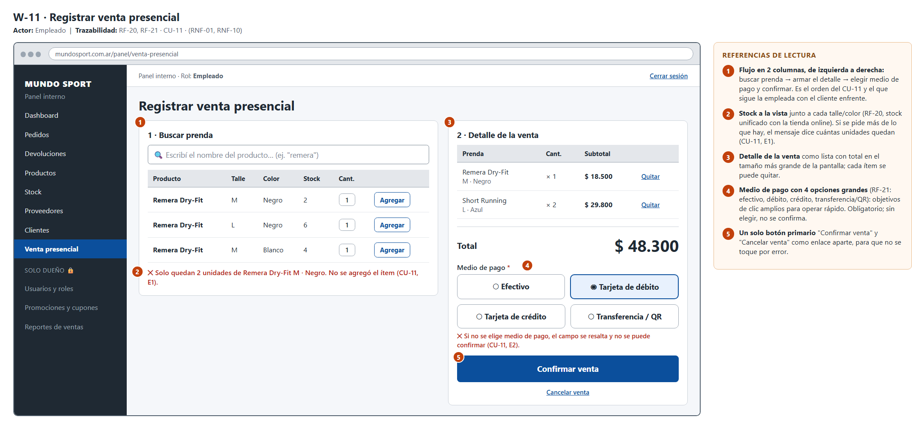

**Patrones de diseño utilizados:** pantalla de punto de venta en dos columnas, buscador con resultados accionables, lista de detalle con total y tarjetas de selección para el medio de pago.

**Justificación:** CU-11 es el caso de uso que más se repite (unas 80 veces por día) y lo usa la empleada con el cliente enfrente, por eso el flujo va de izquierda a derecha en el mismo orden del caso de uso: buscar la prenda → armar el detalle → elegir el medio de pago y confirmar. Cada resultado muestra el stock (RF-20, unificado con la tienda online) y, si se pide más de lo que hay, el mensaje dice cuántas unidades quedan (CU-11, E1). Los 4 medios de pago de RF-21 (efectivo, débito, crédito y transferencia/QR) son tarjetas grandes, fáciles de acertar rápido; es obligatorio elegir uno para confirmar (CU-11, E2). El total es lo más grande de la pantalla, "Confirmar venta" es el único botón relleno y "Cancelar venta" queda como enlace aparte para no tocarlo por error.

**Formulario (si aplica):**
- Cantidad de campos: 1 búsqueda; por cada ítem talle, color y cantidad; y 1 elección obligatoria (medio de pago, 4 opciones).
- Flujo: todo en una pantalla.
- Validaciones relevantes: stock suficiente por producto-talle-color (E1); medio de pago obligatorio, con el campo resaltado si falta (E2, RNF-10); si falla el cobro, se conservan los ítems en pantalla (E3).

---

## Pantalla / Módulo 11 — Agregar producto al catálogo

**Wireframe:** `diagramas/wireframes/12-alta-producto.png`

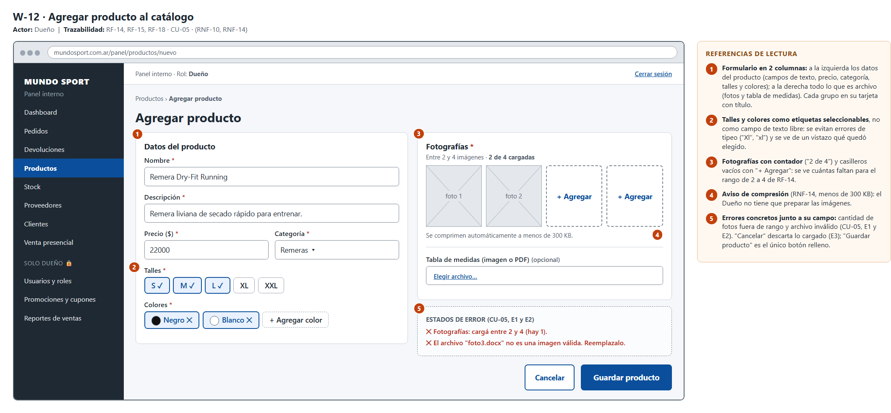

**Patrones de diseño utilizados:** formulario en dos columnas con grupos en tarjetas, etiquetas seleccionables (talles y colores), carga de archivos con contador y mensajes de error junto al campo.

**Justificación:** el formulario se completa unas 10 veces por mes y siempre por el Dueño (CU-05), una persona que ya conoce los datos, así que no justifica un asistente por pasos: va en una sola pantalla con dos columnas, los datos del producto a la izquierda y los archivos (fotos y tabla de medidas) a la derecha, cada grupo en su tarjeta con título (proximidad). Talles y colores se eligen como etiquetas y no con texto libre, lo que evita errores de tipeo ("Xl", "xl") y deja ver de un vistazo qué quedó elegido. Las fotos tienen un contador ("2 de 4") y casilleros vacíos con "+ Agregar" para que se vea cuántas faltan para el rango de 2 a 4 de RF-14; el aviso de compresión (RNF-14, menos de 300 KB) le evita al Dueño preparar las imágenes.

**Formulario (si aplica):**
- Cantidad de campos: 8 (nombre, descripción, precio, categoría, talles, colores, fotografías y tabla de medidas opcional).
- Flujo: todo en una pantalla.
- Validaciones relevantes: datos obligatorios; entre 2 y 4 fotografías; archivo adjunto que sea una imagen válida (CU-05, E1 y E2); compresión automática a menos de 300 KB (RNF-14); el error indica el campo (RNF-10); "Cancelar" descarta lo cargado (E3) y, si falla el guardado, se conservan los datos para reintentar (E4).

---

## Consideraciones de accesibilidad

_Al menos una consideración concreta, relacionada con el sistema y sus usuarios reales
(no una mención genérica de "cumple con WCAG"). Ejemplos: contraste para usuarios con
baja visión, tamaño de tap targets para uso móvil, navegación por teclado, textos
alternativos en ícono-only buttons._

- **Contraste medido (mínimo 4,5:1 para texto):** texto principal #1F2933 sobre blanco 14,8:1; texto de botón primario blanco sobre #0B4F9C 8,0:1; precio en oferta #B42318 sobre blanco 6,6:1; etiquetas de estado entre 5,5:1 y 7,1:1. Hay una excepción detectada: el texto de ejemplo dentro de los campos (#7B8794) da 3,7:1; en el diseño final se usará #52606D (6,5:1) y las etiquetas siempre irán fuera del campo.
- **No depender solo del color:** los estados de pedido y de pago llevan ícono y texto ("✓ Entregado", "⚠ Crítico"), el talle sin stock va tachado y con la leyenda "sin stock", y los errores combinan ✕, mensaje y borde rojo. Esto importa en el panel, donde la empleada distingue estados de un vistazo, y para personas con daltonismo.
- **Tamaño de los objetivos táctiles:** como el diseño es responsive desde 360 px (RNF-09) y gran parte de los clientes comprará desde el celular, los botones, talles, filtros y opciones de pago miden al menos 44 px de alto en la versión móvil, y el botón de pago de Mercado Pago ocupa todo el ancho.
- **Navegación por teclado en las tareas repetitivas:** el registro de ventas presenciales (unas 80 veces por día, CU-11) y los formularios del panel tienen que poder completarse con Tab en el orden visual, con foco visible, etiquetas asociadas a cada campo y botones reales (no imágenes clicables).
- **Textos alternativos:** cada una de las 2 a 4 fotos de producto (RF-14) lleva un texto que describe la prenda y la vista ("Remera Dry-Fit Running negra, vista frontal"), y los botones que son solo ícono (carrito, ✕ de cerrar filtros) tienen nombre accesible.
- **Mensajes comprensibles:** los errores dicen la causa y qué hacer, sin jerga ("Ingresá el DNI sin puntos (7 u 8 números)", "No hay envío a domicilio para ese código postal; podés retirar en el local"), y el indicador de carga (RNF-11) incluye texto ("Cargando…") para que lo anuncien los lectores de pantalla.
